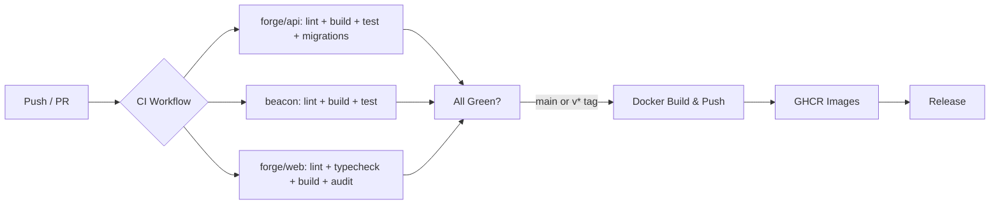
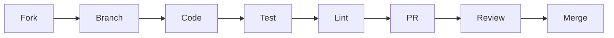

# ⚔️ Forge Control Plane

<p align="center">
  
  
  
  
  
  
  
  
  
</p>

<p align="center">
  <b>Cloud-native game server orchestration — modern, scalable, and built for serious hosting providers.</b>
</p>

<p align="center">
  <i>Replaces traditional PHP-based panels (Pelican, PufferPanel) with a high-performance Go + Next.js stack.</i>
</p>

<hr>

## ✨ Features at a Glance

| 🚀 **Performance** | 🔒 **Security** | 🎮 **Game Server Mgmt** | ☁️ **Orchestration** |
|---|---|---|---|
| Go + Fiber async HTTP | WebAuthn / Passkeys | Console WebSocket + power | Placement engine |
| Next.js 15 App Router | 2FA / TOTP | File CRUD + archive/extract | Multi-region capacity |
| React 19 + TanStack Query | JWT + API keys (scoped) | SFTP (native, delegated auth) | Migration planner |
| PostgreSQL 16 + Redis 7 | HMAC-signed heartbeats | Backups (local zip + S3) | Evacuation planner |
| Docker / containerd / k8s | Container hardening | Schedules + databases | Recovery coordinator |
| Prometheus + Grafana | AES-256-GCM at rest | Mounts + webhooks | Auto-scaling |
| Multi-arch Docker images | Path-traversal protection | Eggs / nests / templates | Reservations system |
| i18n in **8 languages** | CSRF + security headers | Startup variables | Resource quotas |

---

## 🏗️ Architecture

```
┌─────────────┐     ┌──────────────┐     ┌───────────────┐     ┌─────────┐
│   Browser   │ ──▶ │  forge/web   │ ──▶ │  forge/api    │ ──▶ │  beacon │
│  (Next.js)  │     │  (React 19)  │     │  (Go + Fiber) │     │ (Go daemon)│
└─────────────┘     └──────────────┘     └───────┬───────┘     └────┬────┘
                                                 │                  │
                                          ┌──────┴──────┐    ┌─────┴─────┐
                                          │ PostgreSQL   │    │  Docker   │
                                          │   Redis      │    │ containerd│
                                          └─────────────┘    │  k8s      │
                                                              │ Firecracker│
                                                              └───────────┘
```

### 🧩 Component Breakdown

| Component | Path | Language | Role |
|---|---|---|---|
| **Forge API** | `forge/api/` | **Go 1.26** + Fiber v2 | REST API, auth, database, orchestration, placement |
| **Forge Web** | `forge/web/` | **Next.js 15** + React 19 | Admin dashboard, server management, real-time console |
| **Beacon** | `beacon/` | **Go 1.26** | Per-node agent: runtime, backups, SFTP, health |
| **Shared SDK** | `packages/sdk/` | TypeScript | Forge API client SDK |
| **Shared Types** | `packages/shared-types/` | TypeScript | Cross-package type definitions |
| **Shared UI** | `packages/ui/` | TypeScript + React | Reusable UI primitives |

---

## 🚀 Quick Start

### Prerequisites

- [Go](https://go.dev/dl/) 1.26+
- [Node.js](https://nodejs.org/) 20+
- [Docker](https://www.docker.com/) + [Compose](https://docs.docker.com/compose/)
- A terminal and 10 minutes ☕

### 1️⃣ Start Infrastructure

```bash
cd infra && docker compose up -d postgres redis && cd ..
```

### 2️⃣ Start the API

```bash
cd forge/api && go run ./cmd/api
```

> Migrations run automatically on first boot. The API listens on `:8080`.

### 3️⃣ Start the Web UI

```bash
cd forge/web && npm install && npm run dev
```

> Opens on `http://localhost:3000` — you'll be greeted by the setup wizard.

### 4️⃣ Start a Beacon (Node Agent)

```bash
cd beacon && go run ./cmd/daemon
```

> Needs a node token from the panel. Listens on `:9090` (API) + `:2022` (SFTP).

### 5️⃣ One-Shot Dev Launcher

```bash
./start-dev.sh
```

> Starts everything — infra, API, web, beacon — with a single command. 🎯

### 🔗 Service URLs

| Service | URL |
|---|---|
| Web UI | `http://localhost:3000` |
| API | `http://localhost:8080/api/v1` |
| API Docs | `http://localhost:8080/api/v1/docs` |
| Beacon Health | `http://localhost:9090/health` |
| PostgreSQL | `localhost:5432` |
| Redis | `localhost:6379` |
| Prometheus | `http://localhost:9091` |
| Grafana | `http://localhost:3001` (`admin` / `admin`) |

---

## 📁 Repository Structure

```
gamepanel/
│
├── 📦 forge/                        # Control plane (the "Forge" brand)
│   ├── 🦾 api/                      # Go + Fiber REST API
│   │   ├── cmd/api/                 #   Entry point
│   │   ├── config/                  #   Typed configuration
│   │   ├── internal/                #   Core logic
│   │   │   ├── auth/                #     Auth (sessions, JWT, WebAuthn, scopes)
│   │   │   ├── domain/              #     Domain models
│   │   │   ├── events/              #     Pub/sub event system
│   │   │   ├── eventstore/          #     Event sourcing
│   │   │   ├── http/                #     HTTP handlers, middleware, routing
│   │   │   ├── orchestrator/        #     Deployment, suspension, views
│   │   │   ├── placement/           #     Placement strategies & scoring
│   │   │   ├── runtime/             #     Runtime adapters (Docker, k8s, etc.)
│   │   │   ├── secrets/             #     AES-256-GCM keyring
│   │   │   ├── services/            #     Business logic services
│   │   │   └── store/               #     Database layer (PG/MySQL/SQLite)
│   │   ├── migrations/              #     SQL migrations (001 → 072+)
│   │   └── docs/                    #     OpenAPI spec, Swagger UI
│   │
│   └── 🎨 web/                      # Next.js 15 dashboard
│       ├── app/                     #   App Router pages
│       │   ├── admin/               #     Admin panels (32+ pages)
│       │   ├── server/[id]/         #     Server detail views
│       │   └── setup/               #     First-run wizard
│       ├── components/              #   React components
│       │   ├── admin/               #     Admin UI components
│       │   ├── server/              #     Server management UI
│       │   └── ui/                  #     Primitives (shell, auth, theme)
│       ├── lib/                     #   API client, contract tests
│       ├── stores/                  #   Zustand state management
│       └── test/                    #   Vitest test files
│
├── 📡 beacon/                       # Node agent (the "Beacon" brand)
│   ├── cmd/daemon/                  #   Entry point
│   ├── config/                      #   Config (YAML / env / flags)
│   └── internal/                    #   Core logic
│       ├── api/                     #     HTTP handlers, middleware
│       ├── auth/                    #     OAuth2, scopes, sessions
│       ├── backup/                  #     Local zip + S3 backups
│       ├── installer/               #     Server software installer
│       ├── runtime/                 #     Docker, containerd, k8s, Firecracker
│       ├── server/                  #     Server lifecycle, console, stats
│       ├── sftpserver/              #     Native SFTP server
│       ├── system/                  #     Atomic ops, rate limiter, lock
│       ├── tokens/                  #     WebSocket token management
│       └── transfer/                #     Server transfer protocol
│
├── 🐳 infra/                        # Infrastructure
│   ├── compose.yml                  #   Full stack Docker Compose
│   ├── nginx.conf                   #   Production reverse proxy
│   ├── prometheus.yml               #   Metrics scraping config
│   ├── grafana/                     #   Grafana dashboards
│   └── ci/                          #   CI helper scripts
│
├── 📚 docs/                         # Documentation
│   ├── architecture/                #   Architecture & domain model
│   ├── development/                 #   Development setup guide
│   ├── operations/                  #   Deployment & security runbooks
│   ├── planning/                    #   Roadmap & vision
│   └── adr/                         #   Architecture Decision Records
│
├── 📦 packages/                     # Shared npm workspaces
│   ├── sdk/                         #   @forge/sdk — API client SDK
│   ├── shared-types/                #   @forge/shared-types
│   └── ui/                          #   @forge/ui — design system
│
├── 📜 scripts/                      # Dev/test/lint helpers
├── 🌐 lang/                         # i18n translations (8 languages)
│
├── 📄 .github/                      # CI/CD, Dependabot, templates
├── 📄 Makefile                      # Build/test/lint/format targets
├── 📄 go.work                       # Go workspace
└── 📄 README.md                     # ← You are here
```

---

## 🎯 What's Implemented

### 🔐 Authentication & Security
- [x] **Sessions** — secure cookie-based auth
- [x] **JWT** — stateless API authentication
- [x] **2FA / TOTP** — two-factor authentication
- [x] **WebAuthn / Passkeys** — passwordless authentication
- [x] **API Keys** — scoped, revocable, rate-limited
- [x] **OAuth2** — social login providers
- [x] **CSRF Protection** — token-based cross-site mitigation
- [x] **Security Headers** — HSTS, X-Frame-Options, X-Content-Type-Options
- [x] **Rate Limiting** — per-endpoint, per-user throttling
- [x] **Encryption at Rest** — AES-256-GCM master key keyring

### 👥 User Management
- [x] **First-run wizard** — `/setup` + `POST /api/v1/setup`
- [x] **Users & Subusers** — hierarchical account management
- [x] **Roles & Permissions** — admin vs. non-admin, granular scopes
- [x] **Password Reset** — email-based recovery flow

### 🖥️ Server Management
- [x] **Nodes** — add, configure, monitor game server nodes
- [x] **Allocations** — IP/port assignment with regions
- [x] **Servers** — full CRUD with resource limits
- [x] **Eggs / Nests / Templates** — pre-configured server blueprints
- [x] **Startup Variables** — per-server environment configuration
- [x] **Console WebSocket** — real-time terminal with xterm.js
- [x] **Power Actions** — start, stop, restart, kill
- [x] **Logs** — streaming and historical log access

### 📁 File System
- [x] **File CRUD** — create, read, update, delete files
- [x] **Archive / Extract** — zip/unzip with path-traversal protection
- [x] **SFTP** — native server (not chroot proxy) with panel-delegated auth
- [x] **Secure Paths** — `safePath` + `safeJoin` traversal guards

### 💾 Backups
- [x] **Local Backups** — zip archive on node storage
- [x] **S3 Backups** — AWS S3 with configurable retention
- [x] **`.pteroignore` Support** — exclude patterns honored
- [x] **Backup Verification** — integrity checks after creation
- [x] **Scheduled Backups** — cron-based automation

### 📅 Schedules & Automation
- [x] **Cron Schedules** — time-based task automation
- [x] **Databases** — server database provisioning
- [x] **Mounts** — shared filesystem mounts
- [x] **Webhooks** — event-driven HTTP callbacks

### 📡 Orchestration (Advanced)
- [x] **Placement Engine** — intelligent server placement with constraints
- [x] **Reservations** — resource reservation system
- [x] **Migration Planner** — server migration orchestration
- [x] **Evacuation Planner** — graceful node evacuation
- [x] **Recovery Coordinator** — automated failure recovery
- [x] **Multi-Region Capacity** — cross-datacenter orchestration
- [x] **Auto-Scaler** — dynamic resource scaling
- [x] **Reconciler** — desired-state reconciliation loop

### 🏥 Observability
- [x] **Prometheus Metrics** — API (`:8080`) + Beacon (`:9090`)
- [x] **Grafana Dashboards** — pre-provisioned visualizations
- [x] **Health Endpoints** — comprehensive health checks
- [x] **Activity Logs** — detailed audit trail
- [x] **Alerting** — Prometheus Alertmanager integration

### 🌍 Internationalization
- [x] **English** 🇬🇧 | **German** 🇩🇪 | **Spanish** 🇪🇸 | **French** 🇫🇷
- [x] **Japanese** 🇯🇵 | **Portuguese** 🇧🇷 | **Russian** 🇷🇺 | **Chinese** 🇨🇳
- [x] **Crowdin Integration** — community-driven translations

### 🐳 Runtime Support
- [x] **Docker** — primary container runtime
- [x] **containerd** — direct OCI runtime
- [x] **Kubernetes** — orchestrated deployments
- [x] **Podman** — daemonless containers
- [x] **Firecracker** — microVM sandboxing

---

## 🧪 Verification Status

| Component | `go build ./...` | `go vet ./...` | `go test ./...` |
|---|---|---|---|
| `forge/api` | ✅ PASS | ✅ PASS | ✅ PASS (100+ tests) |
| `beacon` | ✅ PASS | ✅ PASS | ✅ PASS (100+ tests) |

| Component | `npm run typecheck` | `npm run build` | `npm run lint` |
|---|---|---|---|
| `forge/web` | ✅ PASS | ✅ PASS | ✅ PASS |

### 📊 Test Coverage

```
forge/api   → http handlers, store integration, services, placement, auth
beacon      → server lifecycle, runtime, sftpserver, backup, installer, tokens
forge/web   → components, API client contracts, auth flows, UI contracts
```

> Run all tests with a single command: `make test`

---

## 🛠️ Development

### Available Commands

| Command | Description |
|---|---|
| `make dev` | Start full dev environment |
| `make build` | Build all 3 components |
| `make test` | Run all Go + JS tests |
| `make lint` | Lint all code (Go + JS + Docker) |
| `make format` | Format all code |
| `make api-test` | Run `forge/api` tests only |
| `make beacon-test` | Run `beacon` tests only |
| `make web-test` | Run `forge/web` tests only |
| `make clean` | Clean build artifacts |

### Scripts

| Script | Description |
|---|---|
| `./scripts/start-dev.sh` | Launch full dev environment |
| `./scripts/stop-dev.sh` | Stop dev environment |
| `./scripts/status.sh` | Check dev service status |
| `./scripts/logs.sh` | View dev logs |
| `./scripts/test.sh` | Run all tests |
| `./scripts/lint.sh` | Run all linters |
| `./scripts/format.sh` | Format all code |
| `./scripts/diagnose.sh` | System diagnostics |
| `./scripts/bench.sh` | Run benchmarks |

### 🐳 Docker Build

```bash
# Build all images
docker compose -f infra/compose.yml build

# Multi-arch build (for production)
docker buildx build --platform linux/amd64,linux/arm64 ...
```

> CI automatically builds multi-arch images on push and publishes to **GHCR**.

---

## 🌐 CI/CD Pipeline



- ✅ **CI** — `.github/workflows/ci.yml` — runs on every push/PR
- 🐳 **Docker** — `.github/workflows/docker.yml` — multi-arch builds
- 🚀 **Deploy** — `.github/workflows/deploy.yml` — production deploy
- 📦 **Release** — `.github/workflows/release.yml` — auto-generated release notes
- 🤖 **Dependabot** — weekly dependency updates (Go, npm, Docker, Actions)

---

## 🏭 Production Deployment

### Docker Compose (Recommended)

```bash
# 1. Clone and configure
git clone https://github.com/your-org/gamepanel.git
cd gamepanel/infra
cp .env.example .env   # Edit with your secrets

# 2. Deploy the full stack
docker compose up -d
```

### Manual Deployment

```yaml
# infra/compose.yml deploys:
services:
  postgres:    # PostgreSQL 16 (primary database)
  redis:       # Redis 7 (cache, sessions, pub/sub)
  api:         # Forge API (Go, port 8080)
  daemon:      # Beacon agent (Go, port 9090)
  web:         # Next.js UI (Node, port 3000)
  prometheus:  # Metrics collection
  grafana:     # Visualization dashboards
  alertmanager:# Alert routing
```

> **Infrastructure as Code** — everything lives in `infra/` with nginx, TLS, and monitoring pre-configured.

---

## 🔒 Security

### Built-in Protections

| Protection | Implementation |
|---|---|
| **Encryption at Rest** | AES-256-GCM with master key keyring |
| **Container Hardening** | `CapDrop: ALL`, `ReadonlyRootfs`, `no-new-privileges` |
| **Path Traversal** | `safePath` + `safeJoin` validation |
| **Heartbeat Auth** | HMAC-SHA256 with constant-time compare |
| **Auth** | Sessions + JWT + WebAuthn + 2FA + API keys (scoped) |
| **CSRF** | Token-based cross-site protection |
| **Headers** | HSTS, X-Frame-Options, X-Content-Type-Options |
| **Rate Limiting** | Per-endpoint and per-user throttling |
| **WebSocket** | Ticket-based authentication |

### 📋 Production Checklist

- [x] Dockerfiles — hardened multi-stage builds
- [x] CI/CD — automated build + test + security checks
- [x] Docker Compose — full production stack
- [x] Environment config — `.env.example` for all modules
- [x] Reverse proxy — nginx with TLS (Let's Encrypt)
- [x] Monitoring — Prometheus + Grafana + Alertmanager
- [x] Session auth — secure cookie configuration
- [x] First-run wizard — secure initial admin setup

---

## 🗺️ Roadmap

```
Phase 1  ████████████████░░░░░  Core platform (current)
Phase 2  ██████████░░░░░░░░░░░  SDK + plugin system
Phase 3  ████████░░░░░░░░░░░░  Marketplace
Phase 4  ██████░░░░░░░░░░░░░░  Advanced analytics
```

### 🔜 Upcoming

- [ ] **WebSocket** `CheckOrigin` allowlist
- [ ] **Short-lived WebSocket tickets** (replace JWT in URL)
- [ ] **Fine-grained permissions** (`requirePermission` middleware)
- [ ] **SDK packages** — `@forge/sdk`, `@forge/shared-types`, `@forge/ui`
- [ ] **Plugin system** — extensible server types & integrations
- [ ] **Marketplace** — one-click egg/template installation
- [ ] **Analytics** — usage metrics & billing integration

---

## 🤝 Contributing

We welcome contributions! Here's how to get started:

### 📋 Guidelines

1. **Read the docs** — start with `docs/` for architecture and conventions
2. **Check the roadmap** — see `docs/planning/` for what's coming
3. **Follow the style** — the codebase has strict linting:
   - Go: `gofmt` + `golangci-lint`
   - TypeScript: Prettier + ESLint
   - Markdown: markdownlint
   - Docker: hadolint
4. **Write tests** — new features must include tests
5. **Run the checks** — `make lint && make test` before submitting

### 🚦 PR Process



### 📜 Code of Conduct

Please be kind, respectful, and constructive. We're building something awesome together. 🚀

---

## 📚 Documentation

The full documentation lives in the [`docs/`](./docs/) directory:

| Directory | Contents |
|---|---|
| `docs/architecture/` | System architecture, domain model, runtime reports |
| `docs/development/` | Developer setup, conventions, workflows |
| `docs/operations/` | Deployment, security, integration runbooks |
| `docs/planning/` | Roadmap, phase plans, vision & tasks |
| `docs/adr/` | Architecture Decision Records |
| `docs/audits/` | Comprehensive technical security audits |
| `docs/recovery/` | Disaster recovery plans |

### 📖 API Documentation

- **OpenAPI Spec**: `forge/api/docs/openapi.json`
- **Swagger UI**: `http://localhost:8080/api/v1/docs` (dev)
- **API Base**: `/api/v1`

---

## 💬 Community

- 🐛 **Issues** — [GitHub Issues](https://github.com/anomalyco/gamepanel/issues)
- 💡 **Feature Requests** — open an issue with the `enhancement` label
- 🤔 **Questions** — open a discussion
- 🔒 **Security Issues** — email the maintainers (see `CODEOWNERS`)

---

## 🏆 Acknowledgments

- **Pelican / PufferPanel** — comparative design insights
- **All contributors** — every PR, bug report, and feature suggestion helps!

---

## ⚖️ License

This project is proprietary software. All rights reserved.

> **Note:** Reference implementations in `reference/` are licensed under their respective upstream licenses (Apache-2.0).

---

<p align="center">
  Made with ❤️ by <a href="https://github.com/anomalyco">@anomalyco</a>
</p>

<p align="center">
  <sub>Built with Go, Next.js, React, TypeScript, PostgreSQL, Redis, Docker, and lots of ☕</sub>
</p>
